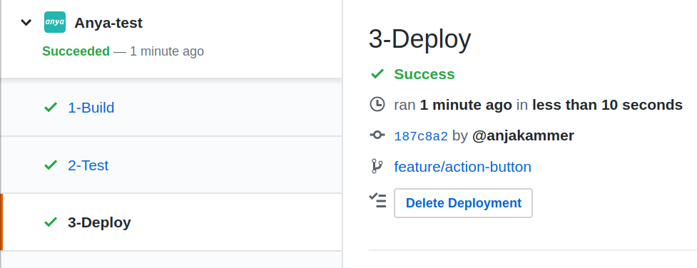

# Delete Preview Deployments

It is not possible to delete a production deployment. Please apply a new update with a new code change for the production branch instead. There are two ways to delete a preview deployment:

### 1. Manual Deployment Deletion

A preview deployment can always be deleted with the push of a button. This button says `Delete Deployment` and is shown for the `3-Deploy` stage when a deployment succeeded.

> 

When the deletion finished, a pull request comment is made in the 'Conversation' tab that shows the deletion for the corresponding commit.
> 

The deployment could be rerun with the optional [manual deployment trigger](manual-deployment.md). However, this would not change anything since the deployment is always made from the underlying commit.

### 2. Purge Preview Deployments Option

You need to enable the `pullRequest.onClose.purgePreviewDeployments` option in the `deploy.yaml` configuration file. (See the article [Default Pipeline](pipeline.md) for the pipeline options.)
If this option is enabled, every preview deployment for the specific pull request is deleted, when it is getting closed through a merge or the button 'close pull request'.

