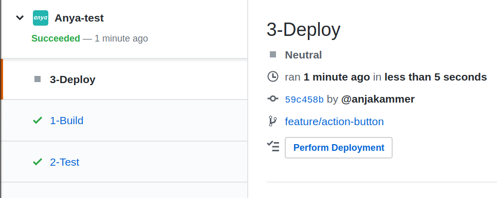

# Manual Deployment Trigger
The manual deployment trigger is a button of the last pipeline stage: _3-Deploy_. The button says `Perform Deployment` and will be shown for both preview and production deployments.
For using this option, deactivate the 'automaticDeployment', or simply delete this key-value pair from the `deploy.yaml` config file.
```javascript
// anya/deploy.yaml
automaticDeployment: false
```

### The Button

When the manual deployment feature is enabled, the deployment step is registered for execution first, but will end in the state 'neutral'. The `Perform Deployment` button then appears. This state will not change the overall 'Succeeded' status of the Check Suite.

> 

### Workflow with a manual deployment trigger (animated)

When the deployment was successful, the status of the deployment stage will change to 'Succeeded'.

> 

- See [here the description of the preview URL](preview-deployment.md), which is visible after a deployment was performed.
- See [here the description of the `Delete Deployment` button](delete-deployment.md).