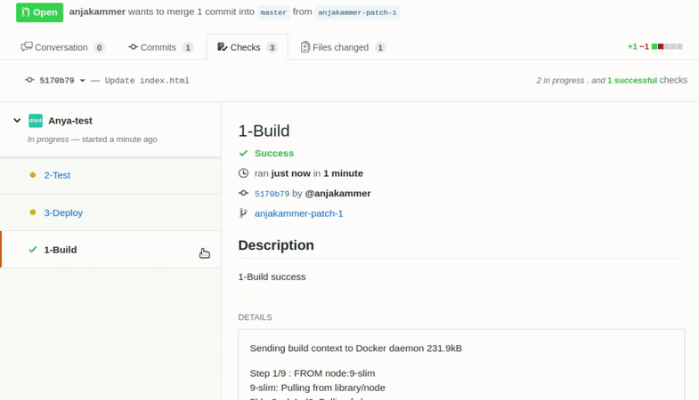

# Manual Deployment Trigger
The manual deployment trigger is a button of the last pipeline stage: _3-Deploy_. The button says `Perform Deployment` and will be shown for both preview and production deployments.
For using this option, deactiviate the 'automaticDeployment', or simply delete this key-value pair from the `deploy.yaml` config file.
```javascript
// anya/deploy.yaml
automaticDeployment: false
```

### Workflow with a manual deployment trigger
> 
