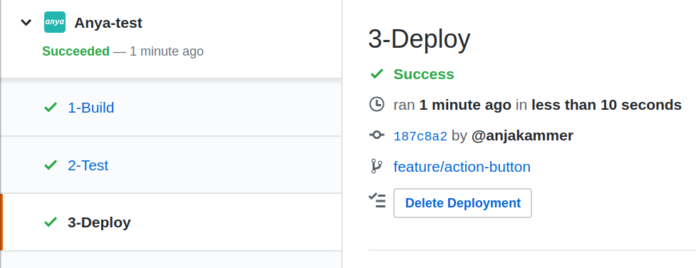
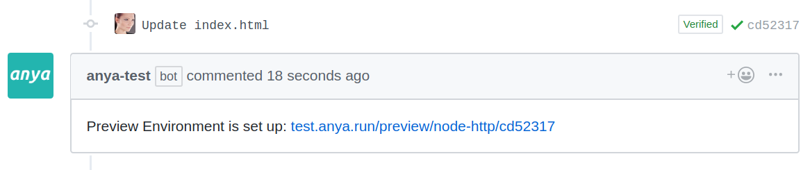

## Preview Deployment

_anya_ offers the possibility to deploy every code change to your _Kubernetes_ cluster and get a URL for the specific commit back as a result. With this URL you can check your changes. This functionality is useful for both frontend and API.

It is important to understand that preview deployments are exclusively made for commit pushes within pull requests. If there is no pull request associated with the currently used branch, _anya_ will not trigger the pipeline execution.
Commits for the production branch, will always lead to a production deployment. See the article [Configuration](../configuration.md), if you would like to know how to define the production branch.
This said, it is recommended to utilize pull requests for changing the production code. You could [prevent direct commits into the production branch](https://help.github.com/en/articles/enabling-branch-restrictions), so that only pull request merges are allowed.

The last stage of the _anya_ Check Suite (aka _anya_ pipeline) is `3-Deploy`. By default, the  deployment is made when all stages before succeeded. You could also activate a [manual approval of a deployment with the push of a button](manual-deployment.md).

Furthermore, it is possible to [delete a single preview deployment](delete-deployment.md), no matter if it was automatically triggered or manually.

> 

Additionally, you can enable the option to post the URL of the new deployed version in the 'Conversations' tab of the pull request. By default, the preview deployment URL can be found in the logs of the deployment stage. The advantage of the pull request comment is that the associated contributers will get notified about the successful deployment, when their corresponding _GitHub_ notifications settings allow it.
Activate this feature in the `deploy.yaml` file in the application's pipeline configuration. 

```javascript
// anya/deploy.yaml
onSuccess:
  previewUrlAsComment: true
```

> 

