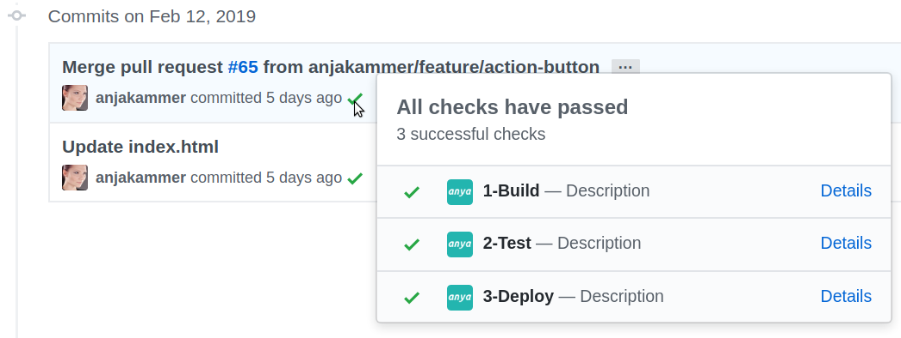

## Production Deployment

A production deployment is performed, when a commit or merge is made inside of the production branch. You can define your production branch name, in the [initial configurations](../configuration.md).

To observe the state of a pipeline, which runs on a production branch commit, click on the icon of a commit, as shown below:

> 

A production deployment cannot be deleted, please commit a new code change instead to update the application.