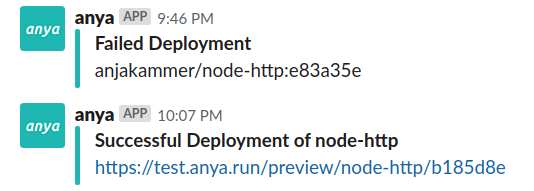

## Slack Notifications

Additionally to the Check Suite status of the _anya_ pipeline, there is an option to get notified for failed or succeeded deployments via _Slack_. To enable this option, set the options: `onFailure.slackNotify` and `onSuccess.slackNotify` in the pipeline configurations file `deply.yaml`. (See: [Default Pipeline](pipeline.md))

> 

See the article [Configuration](../configuration.md) for the description on how to provide the needed _Slack_ channel information. See [this tutorial of _Slack_](https://api.slack.com/incoming-webhooks#), on how to allow third-party integrations such as _anya_ to post messages.

